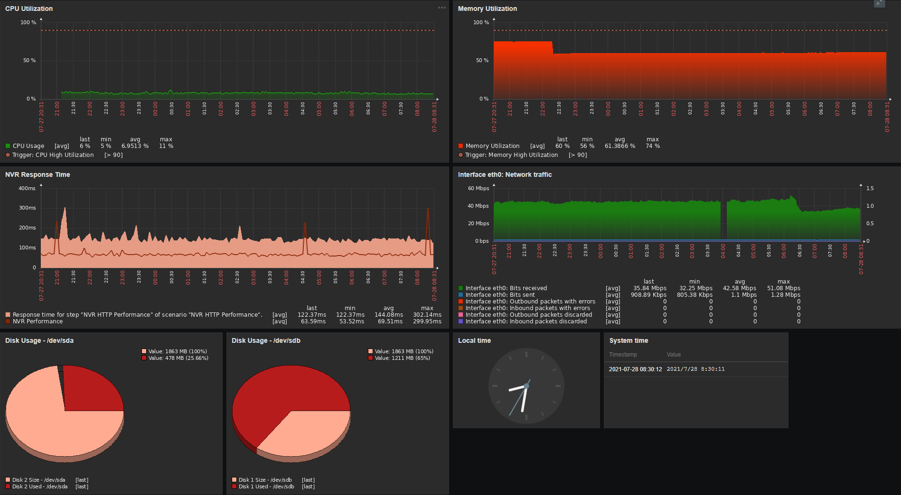

# Zabbix SNMP Template - NVR Intelbras NVD 3116 P

### OVERVIEW

Monitore dados SNMP do seu NVR Intelbras.
 <i>Monitor SNMP data from your Intelbras NVR.</i>

Feito especificamente para o NVR modelo "NVD 3116 P". Pode funcionar em outros modelos de NVR da <b>Intelbras ou Dahua</b>, mas, para isso, adaptações podem ser necessárias.
 <i>Made specifically for NVR model "NVD 3116 P". Might work on different NVR models from <b>Intelbras or Dahua</b>, but, for that, adaptations might be required.</i>

Testado no Zabbix 5.4.
 <i>Tested on Zabbix 5.4.</i>

 

<!--

-->

### MACROS USED
<table>
    <tr>
	    <th><b>Name</b></th>
	    <th><b>Default</b></th>
	</tr>
	<tr>
        <td>{$HTTP_PORT}</td>
		<td>80</td>
	<tr>
        <td>{$HTTPS_PORT}</td>
        <td>443</td>
	<tr>
        <td>{$MEDIA_PORT}</td>
        <td>37777</td>
	<tr>
        <td>{$SNMP.TIMEOUT}</td>
        <td>5m</td>
	</tr>
</table>

Essas macros devem ser alteradas a nível de Host para refletir as portas de seu host monitorado.
 <i>These macros should be changed at Host level to reflect your monitored host ports.</i>

 

### TEMPLATE LINKS
<table>
    <tr>
        <td>Interfaces Simple SNMP <i>(Network interfaces discovery)</i></td>
	</tr>
</table>
 

### ITEMS COLLECTED
<table>
	<tr>
        <td>Camera IP <i>(discovery)</i></td>
  </tr>
	<tr>
        <td>Camera Name <i>(discovery)</i></td>
  </tr>
	<tr>
        <td>Camera Status <i>(discovery)</i></td>
  </tr>
	<tr>
        <td>CPU Usage</td>
  </tr>
	<tr>
        <td>Device IP</td>
  </tr>
	<tr>
        <td>Device Serial Number</td>
  </tr>
	<tr>
        <td>Device Status</td>
  </tr>
	<tr>
        <td>Device System Version</td>
  </tr>
	<tr>
        <td>Device Type</td>
  </tr>
	<tr>
        <td>Disk Name <i>(discovery)</i></td>
  </tr>
	<tr>
        <td>Disk Percent Free <i>(discovery)</i></td>
  </tr>
	<tr>
        <td>Disk Size <i>(discovery)</i></td>
  </tr>
	<tr>
        <td>Disk Status <i>(discovery)</i></td>
  </tr>
	<tr>
        <td>Disk Used <i>(discovery)</i></td>
  </tr>
	<tr>
        <td>Memory Utilization</td>
  </tr>
	<tr>
        <td>NVR Performance</td>
  </tr>
	<tr>
        <td>NVR Performance Average</td>
  </tr>
	<tr>
        <td>NVR WEB Performance</td>
  </tr>
	<tr>
        <td>SNMP agent availability</td>
  </tr>
	<tr>
        <td>SNMP Bad community</td>
  </tr>
	<tr>
        <td>SNMP traps (fallback)</td>
  </tr>
	<tr>
        <td>System contact details</td>
  </tr>
	<tr>
        <td>System description</td>
  </tr>
	<tr>
        <td>System location</td>
  </tr>
	<tr>
        <td>System name</td>
  </tr>
	<tr>
        <td>System object ID</td>
  </tr>
	<tr>
        <td>System Status</td>
  </tr>
	<tr>
        <td>System Time</td>
  </tr>
	<tr>
        <td>TCP Established Connections</td>
  </tr>
	<tr>
        <td>Uptime Enterprise</td>
  </tr>
	<tr>
        <td>Uptime Generic</td>
  </tr>
</table>
 

### TRIGGERS
<table>
	<tr>
        <td>Camera status changed <i>(discovery)</i></td>
  </tr>
	<tr>
        <td>CPU High Utilization</td>
  </tr>
	<tr>
        <td>Device IP changed</td>
  </tr>
	<tr>
        <td>Device Status Changed</td>
  </tr>
	<tr>
        <td>Device System Version changed</td>
  </tr>
	<tr>
        <td>Disk ERROR <i>(discovery)</i></td>
  </tr>
	<tr>
        <td>Memory High Utilization</td>
  </tr>
	<tr>
        <td>No SNMP data collection</td>
  </tr>
	<tr>
        <td>SNMP Bad community attempt - <i>Depends on: No SNMP data collection</i></td>
  </tr>
	<tr>
        <td>System has been restarted (uptime < 10m) - <i>Depends on: No SNMP data collection</i></td>
  </tr>
	<tr>
        <td>System name has changed</td>
  </tr>
	<tr>
        <td>System Status Offline</td>
  </tr>
</table>
 

### GRAPHS
<table>
  <tr>
        <td>CPU Utilization</td>
  </tr>
	<tr>
        <td>Disk Usage <i>(discovery)</i></td>
  </tr>
	<tr>
        <td>Memory Utilization</td>
  </tr>
	<tr>
        <td>NVR Response Time</td>
  </tr>
	<tr>
        <td>Total connections</td>
  </tr>
</table>
 

### DASHBOARDS
<table>
	<tr>
        <td>NVR Dashboard</td>
  </tr>
</table>
 

### DISCOVERY RULES
<table>
	<tr>
        <td>Network interfaces discovery <i>(Interfaces Simple SNMP template)</i></td>
  </tr>
	<tr>
        <td>Disk Discovery <i>(items, trigger, graph)</i></td>
  </tr>
	<tr>
        <td>Camera Discovery <i>(items, trigger)</i></td>
  </tr>
</table>
 

### WEB SCENARIOS
<table>
	<tr>
        <td>NVR HTTP Performance</td>
  </tr>
</table>
 

### DASHBOARD EXAMPLE

 

### CHECK OUT <a href="https://github.com/diasdmhub/Intelbras_NVD3116P_Template/wiki">HOW TO IMPORT NVR Intelbras "NVD 3116 P" TEMPLATE WIKI.</a>
 

### TESTED AS IS

<b>
  Esta template foi testada somente com o NVR Intelbras "NVD 3116 P". Pode funcionar em outros NVRs Intelbras ou Dahua também.
   <i>This template was tested only with Intelbras NVR "NVD 3116 P". It might work with other Intelbras or Dahua NVRs as well.</i>

  Observações são bem-vindas.
   <i>Feedbacks are welcome.</i>
</b>

